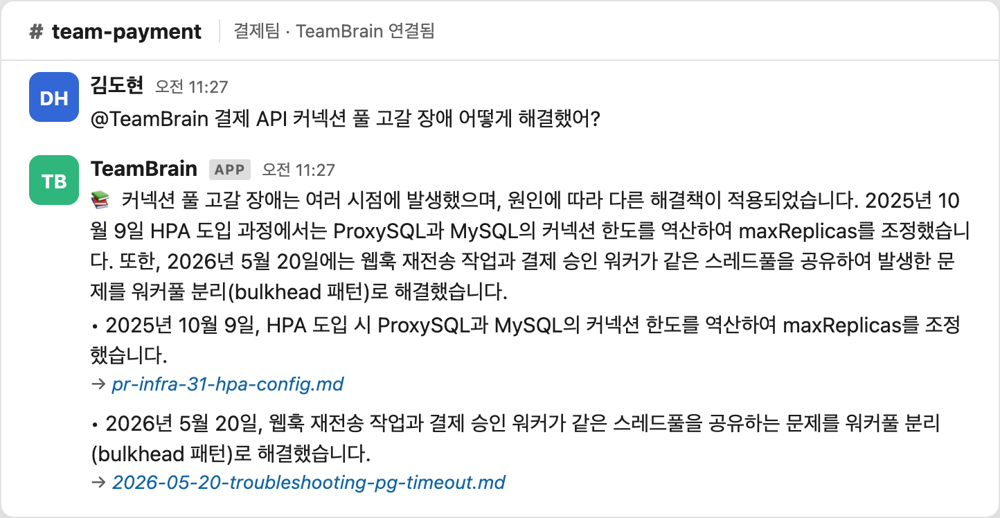
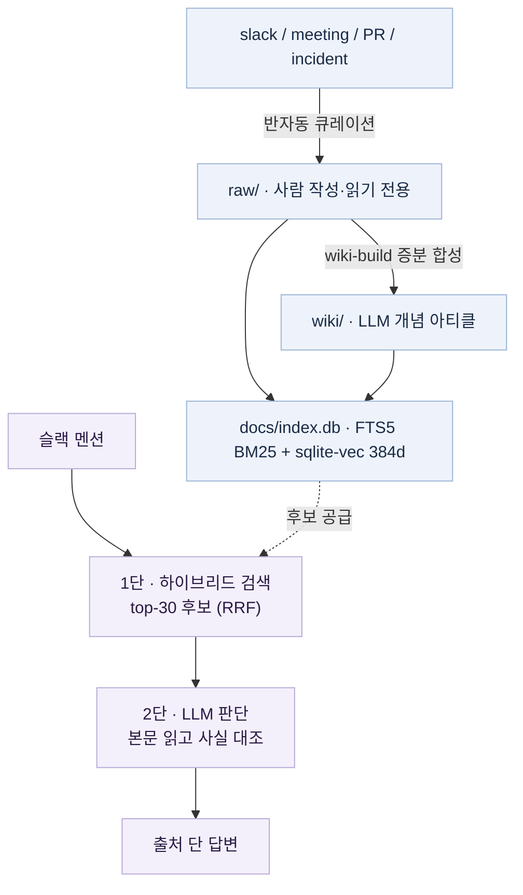
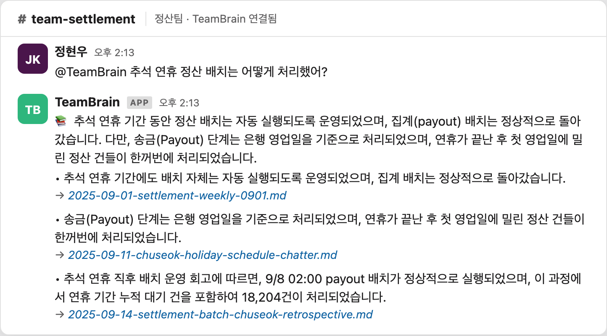
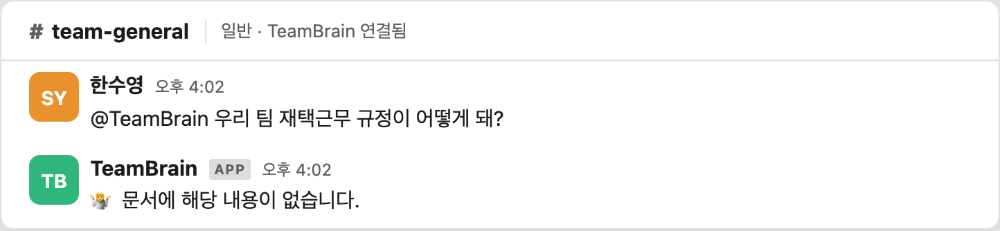

# TeamBrain

**닮은 오답이 아닌 진짜 결정을 찾아주는 팀 지식 위키봇.**

노이즈·near-miss가 섞인 날것의 슬랙로그에서, 그럴듯하게 닮은 오답이 아니라 **진짜 결정 기록**을 판별해 답한다. 검색은 후보를 넓히는 역할만, **판별은 LLM이 본문을 읽고** 한다.

> 가상 PG사 **Nimbus Pay**(결제·정산·인프라 3팀, 24개월) 슬랙로그를 시뮬레이션한 포트폴리오 프로젝트.

---

## 핵심 문제: relevance ≠ truth

위키봇/RAG가 무너지는 건 "모르겠습니다"가 아니라 **닮은 오답을 근거로 "자신있게 틀린 답"을 신뢰된 출처처럼 내놓을 때**다.

- **near-miss** = 같은 제품명·약어·날짜를 공유하지만 맥락이 다른 닮은 오답.
  예: 진짜 *2024-10-30 장애* vs *CI 풀 고갈* vs *다른 가맹점 온보딩 논의*.
- 일반 RAG는 셋 다 "관련 문서"로 보고 종합 → **출처도 달고 환각도 안 했는데 틀린 답**.
- **relevance(관련성)가 truth(진실)를 보장하지 못한다.** 이걸 자체 측정으로 확인했다(↓).

이 문제는 깨끗하게 큐레이션된 개인 노트(PKM/세컨드브레인)엔 없다. 같은 토큰을 공유하는 near-miss가 진짜 결정과 뒤섞인 **실무 데이터에서만** 생긴다.

---

## 측정으로 증명한 결론

규모를 키워 검색이 깨지는 지점을 직접 재현한 뒤, 그 실패를 메우는 설계를 도입했다.

| Phase | 한 일 | 결과 |
|-------|------|------|
| 3 | 노이즈 824건 증식 (raw 987) | 정답을 *비슷한 건초더미*에 묻는 지반 |
| 4 | grep + LLM 추론, 16질문 | 15/16 정답 (단 grep이 강했던 것) |
| 5a | near-miss 증식 (raw → 1576) | 모든 실패가 **recall 실패** |
| 5b | 하이브리드(BM25+임베딩+RRF) recall@10 | **BM25 0/6, 임베딩 0/6, 하이브리드 1/6** |

768d 모델로 정답 vs near-miss 코사인 분리를 직접 재봐도 동률(C3: 0.527/0.523)·역전(A4: 0.550/**0.626**)이라 **모델 크기로 풀 문제가 아니다.**

> **이 코퍼스에서 정답을 가르는 건 retrieval(검색)이 아니라 reasoning(판단)이다.**
> 검색은 top-1을 내는 게 아니라 **후보를 넓히는 recall 역할**(BM25/벡터 각 top-100 → RRF → LLM에 top-30). 그 위에서 LLM이 본문을 읽고 진짜를 고른다.

> 통찰 자체(검색은 됐는데 어느 게 진짜인지 못 가린다)는 학계에 정립돼 있다(RAMDocs·MADAM-RAG). 기여는 *최초 발견*이 아니라 **노이즈 많은 실제 슬랙로그 위키봇에 구현하고 자체 측정으로 증명한 것**이다.

실제로 "예전에 커넥션 풀 터졌던 거"처럼 막연히 물어도 여러 시점·문서(인프라 PR + 회고)를 교차 종합해 출처와 함께 답한다:



---

## 아키텍처

진실 공급원은 **마크다운 + git**. 데이터는 위에서 아래로 단방향으로 흐른다.



**핵심 설계 결정**

- **검색 2단 구조.** 1단이 top-30 후보를 떠주고, *정답을 가르는 건 본문을 읽는 2단 LLM이다.*
- **노이즈는 수집에서 거른다.** 검색 셋 다 못 거르므로(5b 입증) 반자동 큐레이션으로 사람이 *남길 가치*를 판단.
- **BM25 + 임베딩은 영구 파트너.** 고유명사·코드명(BM25) ↔ 의미 유사(임베딩), 서로 다른 실패를 메운다.
- **증분·멱등 빌드.** `source_hashes` 대조로 dirty raw만 재처리, 모든 변경은 git으로 가역.

---

## 빠른 시작

> 모든 명령은 **프로젝트 루트에서** 실행 (`docs/index.db` 경로가 루트 기준).

```bash
pip install -r scripts/llm/requirements.txt -r scripts/search/requirements.txt
python3 scripts/search/build_index.py                          # 인덱스 빌드 → docs/index.db
python3 scripts/llm/wiki_qa.py "추석 정산 배치는 언제 처리했나?"   # QA CLI (로컬 Ollama 필요)
```

**슬랙봇 기동.** `.env`에 `SLACK_BOT_TOKEN`(xoxb)·`SLACK_APP_TOKEN`(xapp)을 설정한 뒤:

```bash
python3 scripts/llm/check_slack.py     # 사전점검: 토큰·Ollama
python3 scripts/llm/slack_bot.py       # Socket Mode 봇 기동
```

봇을 멘션하면 → 검색 → LLM 판단 → 출처 단 답변. 근거가 없으면 추측하지 않고 **거부**한다.

| 진짜 결정을 찾아 답함 | 근거 없으면 추측 대신 거부 |
|---|---|
|  |  |

---

## 기술 스택

| 계층 | 스택 |
|------|------|
| 진실 공급원 | 마크다운 + git (raw 입력 / wiki LLM 산출) |
| 검색 | SQLite 단일 파일 (FTS5 BM25 + sqlite-vec 384d, RRF · `paraphrase-multilingual-MiniLM-L12-v2`) |
| LLM | 로컬 **Ollama** (`MODEL`/`HOST` 한 줄로 로컬↔클라우드 전환) |
| 봇 | `slack_bolt` Socket Mode |
| 데이터 합성 | `wiki-build` 스킬 (raw → wiki 개념 아티클 증분 합성) |

```
raw/        사람이 작성한 원본 입력 (읽기 전용)
wiki/       LLM이 합성한 개념 아티클 ([[wikilink]]) · 진실 공급원
scripts/
  ├ search/ 하이브리드 검색 엔진 (build_index.py, hybrid_search.py)
  └ llm/    슬랙봇 QA 2단 파이프라인 (wiki_qa.py, slack_bot.py, ollama_client.py)
docs/       설계·측정 문서
```

---

## 실 운영이라면: 자동화 시나리오 (Roadmap · 포트폴리오에선 언급만)

지금은 사람이 raw를 정리하고 직접 `build_index.py`를 돌려 데이터를 갱신한다. **실제 회사에 붙인다면** 이 사이클을 무인으로 돌릴 수 있다:

```
[퇴근 30분 전 · cron]
  ① 수집   슬랙 채널 / 사내 파일 경로에서 금일 변경분을 raw/로 자동 수집
  ② 빌드   wiki-build → 검색 인덱스 재빌드 (증분·멱등)
  ③ 보고   금일 업무 요약을 슬랙 채널에 push (broadcast)
```

이건 **pull**(멘션→답변, *구현됨*)과 짝을 이루는 **push**(요약 broadcast) 모드다. 새 엔진이 아니라 *어댑터 뒤·파이프라인 위*의 오케스트레이션 레이어라, 같은 검색·LLM 인프라에 cron만 얹으면 된다.

> **포트폴리오 단계에선 구현하지 않고 언급만 한다.** 자동화는 *증폭기*라, 판별 품질을 검증하기 전에 일일 자동 push를 켜면 잘못된 합성을 매일 팀 전체에 자동 방송하기 때문이다. 검증이 먼저, 자동화는 그 위에.

**그 외 확장**

- **규모 게이트.** 임베딩/벡터는 금지가 아니라 *규모가 요구할 때* 본격화. 라우팅이 답을 못 찾기 시작하면 1회 측정 후 확장.
- **데모 → 운영.** 데모는 Ollama를 테스트 시에만, 운영은 상시 가동. 진실 공급원이 파일이라 데이터 이전 없이 같은 파일을 읽으면 되고, LLM은 한 줄로 로컬↔클라우드 전환.

---

## 비범위 (의도적으로 안 하는 것)

- **전자동 전체 채널 크롤링.** *측정이 금지했다*(노이즈를 검색으로 못 거름). 수집은 사람이 가치를 고르는 반자동.
- **처음부터 임베딩/벡터DB.** 규모 게이트 전 도입은 추측 도입. 측정 후 도입.
