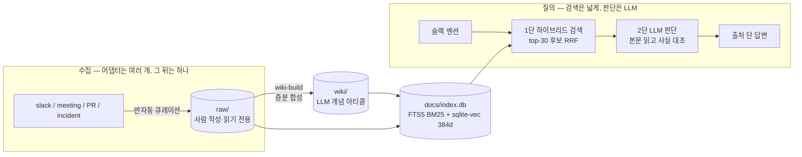

# TeamBrain

**닮은 오답이 아닌 진짜 결정을 찾아주는 팀 지식 위키봇.**

> 수년치 슬랙로그처럼 *노이즈·near-miss가 섞인 날것의 실무 데이터*에서, 그럴듯하게 닮은 오답이 아니라 진짜 결정 기록을 판별해 답한다. raw 마크다운 + git이 진실 공급원이고, 검색은 후보를 넓히는 역할만, **판별은 LLM이 본문을 읽고** 한다.

가상 PG사 **Nimbus Pay**(결제·정산·인프라 3팀, 24개월 운영)의 슬랙로그를 시뮬레이션해, 실제 팀이 수년간 써온 상황을 재현한 포트폴리오 프로젝트다.

---

## 왜 이 프로젝트인가 — relevance ≠ truth

일반적인 위키봇/RAG가 깨지는 지점은 "모르겠습니다"가 아니다. **닮은 오답 문서를 근거로 "자신있게 틀린 답"을 신뢰된 출처처럼 제시할 때** 신뢰가 무너진다. 이 한 번이 명백히 틀린 답보다 신뢰를 더 크게 무너뜨린다.

- **near-miss** = 같은 제품명·약어·날짜를 공유하지만 맥락이 다른 닮은 오답.
  예: 진짜 *2024-10-30 장애* vs *CI 테스트 환경 풀 고갈* vs *다른 가맹점 온보딩 논의*.
- 일반 RAG는 이들을 모두 "관련 문서"로 보고 종합한다 → **출처도 달고, 환각도 안 했는데, 틀린 합성 답**을 만든다.
- **relevance(관련성) 점수가 truth(진실)를 보장하지 못한다.** 이걸 우리 데이터의 수치로 직접 확인했다(아래 측정 서사).

이 문제는 **깨끗하게 큐레이션된 개인 노트(전형적 PKM/세컨드브레인)에는 아예 없다** — 같은 토큰을 공유하는 near-miss가 진짜 결정과 뒤섞인 실무 데이터에서만 생긴다.

### 차별점 (정직하게)

| 대상 | 그들이 못 보는 것 |
|------|------------------|
| 세컨드브레인 / PKM | 입력이 깨끗하다는 전제 → near-miss 문제가 없다 |
| 일반 위키봇 / RAG | "retrieval만 고치면 된다"는 프레임 → **reasoning 사각지대** |

> 이 통찰("검색은 됐는데 어느 게 진짜인지 못 가린다")은 학계에 이미 정립돼 있다(RAMDocs·MADAM-RAG의 adjudication·knowledge conflict). TeamBrain의 기여는 *최초 발견*이 아니라 **그 통찰을 노이즈 많은 실제 팀 슬랙로그 위키봇에 구현하고 자체 측정으로 증명한 것**이다. "할루시네이션 방지"(일반 RAG 기본기)나 "보안용 로컬 LLM"(제약 조건)은 약한 차별점이라 내세우지 않는다.

---

## 측정 서사 — 이 프로젝트의 핵심 자산

처음부터 모든 기술을 넣지 않았다. **규모를 키워 검색이 깨지는 지점을 직접 재현한 뒤, 그 실패를 메우는 설계를 도입**했다. 측정 기반 의사결정의 기록이다.

| Phase | 무엇을 했나 | 결과 |
|-------|------------|------|
| **3** | 일상 노이즈 824건 시뮬레이션 (raw 987 = 백본 163 + 노이즈 824) | 검색을 직접 깬 게 아니라, 정답을 *비슷한 건초더미*에 묻는 near-miss "지반"을 깔았다 |
| **4** | agentic retrieval(index.md 라우팅 + grep + LLM 추론), 16질문 | **15/16** 정답. 단 절반 이상(9/16)은 라우팅이 아니라 LLM이 raw를 grep으로 직격해 푼 것 |
| **5a** | 표적 6질문에 near-miss 노이즈 증식 (raw 987 → 1576) | grep+LLM이 깨지는 임계를 실측. 모든 실패가 **recall 실패**(정답 후보를 triage에서 버림), rank 실패는 0건 |
| **5b** | 하이브리드 검색(BM25 + 임베딩 + RRF)을 실제로 짓고 recall@10 측정 | **BM25 0/6, 임베딩 0/6, 하이브리드 1/6** — 검색은 near-miss를 못 가린다 |

### 5b의 결정적 측정

> recall@10은 **384d MiniLM**(`paraphrase-multilingual-MiniLM-L12-v2`)로 색인한 **1741건**(raw 1572 + wiki/sources 169)에서 측정. 5a hard near-miss 6질문(top-10 recall) 기준. (raw가 5a 1576에서 1572로 줄어든 건 색인 직전 일부 raw가 통합·정리된 결과.)

| 검색 방식 (384d) | near-miss recall@10 |
|------------------|---------------------|
| BM25 (FTS5) | **0/6** |
| 임베딩 (sqlite-vec) | **0/6** |
| 하이브리드 (RRF) | **1/6** (C4만) |

**"더 큰 모델이면 되지 않나?"** — 별도로 **768d 모델**(`embeddinggemma-300m`)로 정답 vs near-miss **코사인 분리만** 직접 재봤다(recall 재측정이 아니라 분리 프로빙):

> ⚠️ 아래는 recall이 아니라 정답·near-miss 두 벡터의 코사인 유사도를 직접 잰 값이다(위 표와 다른 측정).

| 질문 | 정답 코사인 | near-miss 코사인 | 판정 |
|------|-----------|------------------|------|
| C3 | 0.527 | 0.523 | 거의 동률 (0.004차) |
| A4 | 0.550 | **0.626** | **역전** (near-miss가 더 높음) |

5a의 hard near-miss는 BM25 표면 토큰뿐 아니라 **임베딩 의미 공간에서도** 정답과 가깝게 설계됐다. 따라서 **모델 크기를 키워 해결될 문제가 아니다.**

### 결론

> **이 코퍼스에서 정답을 가르는 건 retrieval(검색)이 아니라 reasoning(판단)이다.**
> 표면 신호(토큰·벡터)로는 분리되지 않고, 본문을 읽고 사실을 대조하는 LLM 판단이 있어야 풀린다. (범위: near-miss 많은 실무 슬랙로그 한정 — 쉬운 단일 정답 질문은 검색만으로 충분.)

이 결론이 검색을 **버리는** 게 아니라 **재정의**한다: 검색은 top-1 답을 내는 게 아니라, **후보를 넓히는 recall 역할**(현 구현: BM25/벡터 각 top-100 풀 → RRF 병합 → LLM에 top-30 전달). 그 위에서 LLM이 본문을 읽고 진짜를 고른다.

실제로 작동한다 — "예전에 커넥션 풀 터졌던 거"처럼 막연히 물어도, 2단 구조가 **여러 시점·여러 문서(인프라 PR + 트러블슈팅 회고)를 교차 종합**해 출처와 함께 답한다(아래는 진짜 봇 출력):


> ※ 측정 정직성: 모든 Phase가 6~16질문 단일 LLM 채점이라 표본이 작다. 단 5b의 0/6~1/6은 표본 노이즈로 설명되지 않는 강한 신호다.

---

## 아키텍처

데이터는 단방향으로 흐른다. **진실 공급원은 마크다운 + git** — 임베딩/벡터/그래프DB 도입 충동이 들면 멈추고 마크다운을 먼저 쓴다(그게 second-brain을 죽인 길).



### 핵심 설계 결정

- **검색 2단 구조.** 1단 하이브리드 검색이 BM25/벡터 각 top-100을 RRF(k=60)로 병합해 **top-30 후보**를 떠주고, 2단 LLM이 그 본문을 읽고 사실을 대조한다. *정답을 가르는 건 2단이다.*
  - 실증: 5b에서 순수 검색이 88~171위로 묻었던 C6(DB 커넥션 풀 고갈) 정답을, 2단(top-30 검색 → LLM 판단)이 실제로 건져냈다.
- **소거법으로 노이즈를 수집에서 거른다.** BM25·임베딩·하이브리드 셋 다 노이즈를 못 걸렀으므로(5b 입증), 거를 곳은 검색이 아니라 **수집뿐**이다 → 반자동 큐레이션(슬랙 `@TeamBrain save` / `:brain:` 이모지, inbox 드롭, `teambrain` 라벨 PR). 사람이 *남길 가치*를 판단한다.
- **BM25는 임베딩의 경유지가 아니라 영구 파트너다.** BM25는 고유명사·코드명에 강하고 임베딩은 어휘가 달라도 의미 유사를 잡는다 → 처음부터 함께 짓는 하이브리드가 프로덕션 RAG 표준.
- **증분·멱등 빌드.** 별도 state.db 없이 wiki frontmatter의 `source_hashes`와 raw의 `git hash-object`를 대조해 dirty raw만 재처리. 변경 없으면 즉시 종료. 모든 변경은 git working tree에 남아 git으로 복구 가능(가역성).
- **출력은 두 모드.** **pull**(멘션→검색→판단→답변, *구현됨*)과 **push**(변경분 요약 broadcast, *Roadmap*). 둘은 같은 엔진을 공유하지 않는다 — 공유되는 건 LLM 호출 인프라(`ollama_client`)뿐, pull의 2단 reasoning 파이프라인은 push가 재사용하지 않는다.

---

## 빠른 시작

> 모든 명령은 **프로젝트 루트에서** 실행한다 (`docs/index.db` 등 경로가 루트 기준 상대경로).

```bash
# 1. 의존성 설치
pip install -r scripts/llm/requirements.txt -r scripts/search/requirements.txt

# 2. 검색 인덱스 빌드 → docs/index.db 생성
python3 scripts/search/build_index.py

# 3. QA CLI 단발 질의 (로컬 Ollama 필요)
python3 scripts/llm/wiki_qa.py "추석 정산 배치는 언제 어떻게 처리했나?"

# 4. 검색만 직접 확인
python3 scripts/search/hybrid_search.py "커넥션 풀 고갈"
```

### 슬랙봇 기동

```bash
# .env에 SLACK_BOT_TOKEN(xoxb)·SLACK_APP_TOKEN(xapp) 설정 (.env.example 참고)
python3 scripts/llm/check_slack.py     # 사전점검: 토큰·Ollama 연결
python3 scripts/llm/slack_bot.py       # Socket Mode 봇 기동 (Ctrl+C 종료)
```

봇을 멘션하면 → 하이브리드 검색 → LLM 판단 → 출처 단 답변을 받는다. 위키에 근거가 없으면 추측하지 않고 **거부**한다.

> Ollama는 RAM 부담이 커 데모 단계에서는 테스트할 때만 켠다. 운영 단계에선 상시 가동(아래 Roadmap).

### 데모

| 진짜 결정을 찾아 답함 | 위키에 없으면 추측 대신 거부 |
|---|---|
|  |  |

near-miss(닮은 오답)가 섞인 코퍼스에서도 진짜 결정 기록을 출처와 함께 답하고(왼쪽), 근거가 없는 질문은 환각하지 않고 거부한다(오른쪽).

---

## 기술 스택

| 계층 | 스택 |
|------|------|
| 진실 공급원 | 마크다운 + git (raw 입력 / wiki LLM 산출) |
| 검색 | SQLite 단일 파일 — FTS5 BM25 + sqlite-vec 384d, RRF (`sentence-transformers`, `paraphrase-multilingual-MiniLM-L12-v2`) |
| LLM | 로컬 **Ollama** (`gemma4`, `ollama_client.py`의 `MODEL`/`HOST` 한 줄로 로컬↔클라우드 전환) |
| 봇 | `slack_bolt` Socket Mode (`requests`, `python-dotenv`) |
| 데이터 합성 | `wiki-build` 스킬 (raw → wiki 개념 아티클 증분 합성) |

### 디렉토리

```
raw/        사람이 작성한 원본 입력 (읽기 전용 · 팀별/소스별)
wiki/       LLM이 raw를 합성한 개념 아티클 ([[wikilink]] 연결) — 진실 공급원
scripts/
  ├ search/ 하이브리드 검색 엔진 (build_index.py, hybrid_search.py)
  └ llm/    슬랙봇 QA 2단 파이프라인 (wiki_qa.py, slack_bot.py, ollama_client.py)
docs/       설계·측정 문서 (.gitignore — 로컬 전용)
index.md    개념 카탈로그 (wiki-build 자동 갱신)
```

---

## Roadmap

- **push 출력 모드 — 스케줄러.** 퇴근 30분 전 cron이 자동으로 (a)수집 → (b)wiki-build → (c)변경분 요약을 슬랙에 broadcast. *Roadmap인 이유:* 자동화는 **증폭기**다 — 판별 품질을 검증하기 전에 일일 자동 푸시를 켜면 잘못된 합성을 매일 팀 전체에 자동 방송한다. 스케줄러는 새 어댑터가 아니라 *어댑터 뒤·파이프라인 위*의 오케스트레이션 레이어라, 검증 후 얹기만 하면 된다.
- **규모 게이트 통과 후 하이브리드 본격화.** 임베딩/벡터DB는 금지가 아니라 *규모가 요구할 때 도입*. 현재(수백~수천 노트)는 라우팅+검색이 충분하고, 라우팅이 답을 못 찾기 시작할 때 1회 측정 후 확장한다.
- **데모 → 운영 전환.** 데모는 Ollama를 테스트 시에만 켜고, 운영은 서버 상시 가동(구조 C). 진실 공급원이 파일이라 데이터 이전 없이 같은 파일을 읽으면 되고, LLM 백엔드는 `MODEL`/`HOST` 한 줄로 로컬↔클라우드 전환된다.

---

## 비범위 (의도적으로 안 하는 것)

- **전자동 전체 채널 크롤링** — 원해서 안 하는 게 아니라, *측정이 금지*했다(노이즈를 검색으로 못 거름). 수집은 사람이 가치를 고르는 반자동 큐레이션.
- **처음부터 임베딩/벡터DB** — 규모 게이트 전 도입은 추측 도입. 측정 후 도입.
